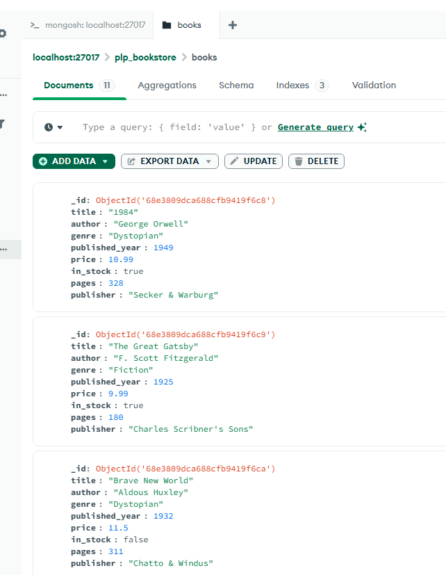

# MongoDB Fundamentals — How to run the scripts

This repository contains example scripts for the Week 1 MongoDB assignment. The important files are:

- `insert_books.js` — a Node.js script that connects to MongoDB and inserts sample book documents.
- `queries.js` — a place to save example queries (you can run queries in `mongosh` or in your app code).
- `package.json` — project manifest (this repo uses CommonJS).

This README explains how to prepare your environment on Windows, install dependencies, start a local MongoDB server (two ways), run the insertion script, and common troubleshooting steps.

## Minimal requirements

- Node.js (v14+ recommended; v18+ preferred)
- MongoDB server (local `mongod`) OR a MongoDB Atlas connection string
- PowerShell (instructions below use PowerShell)

## 1) Install Node dependencies

Open a PowerShell terminal in the project folder (the folder that contains `insert_books.js` and `package.json`) and run:

```powershell
# Install the MongoDB Node.js driver locally
npm install mongodb
```

This will add the `mongodb` package to `node_modules` so `require('mongodb')` works.

## 2) Start a MongoDB server

You have two common options: run the Windows service (recommended if MongoDB is installed as a service) or run `mongod` manually.

### Option A — Start the MongoDB Windows service (recommended)

1. Open PowerShell as Administrator (right-click PowerShell → Run as Administrator).
2. Start the service and check status:

```powershell
Start-Service -Name MongoDB
Get-Service -Name MongoDB | Format-Table -AutoSize
```

3. Verify MongoDB is listening on the default port 27017:

```powershell
netstat -ano | findstr 27017
```

If the service starts successfully and you see a process listening on port 27017, continue to run the script (next section).

If `Start-Service` fails, note the error. You can inspect the service configuration to find the `mongod.exe` path and the config file it uses:

```powershell
sc.exe qc MongoDB
```

Then inspect the mongod config file (path shown in the `BINARY_PATH_NAME`) to see the `dbPath` and `logPath` used by the service. Example:

```powershell
Get-Content 'C:\Program Files\MongoDB\Server\<version>\bin\mongod.cfg'
Get-Content 'C:\Program Files\MongoDB\Server\<version>\log\mongod.log' -Tail 100
```

Common service problems:

- Service won't start due to missing `dbPath` or permissions — check the config `dbPath` and create the folder or fix permissions.
- Service path is incorrect (maybe a different MongoDB install) — `sc.exe qc MongoDB` shows the path.

### Option B — Run `mongod` manually (quick test, no service required)

If you don't want to use the Windows service or it isn't working, run `mongod` directly in a separate terminal window.

1. Create a simple data directory that you own, e.g.:

```powershell
New-Item -ItemType Directory -Path 'C:\Users\$env:USERNAME\data\db' -Force
```

2. Start `mongod` pointing to that folder. Use the real path to your `mongod.exe` (the service config output from `sc.exe qc MongoDB` shows the exact path). Example:

```powershell
# Example path — replace with your installed mongod.exe if different
& 'C:\Program Files\MongoDB\Server\8.2\bin\mongod.exe' --dbpath 'C:\Users\dell\data\db'
```

Leave that terminal open — `mongod` will print logs and report "waiting for connections on port 27017" when ready. Then run the Node script in a separate terminal.

If `mongod` cannot be found, install MongoDB Community Server: https://www.mongodb.com/try/download/community

## 3) Run the insertion script

Once MongoDB is running and listening on port 27017, run:

```powershell
cd 'C:\Users\dell\Documents\MERN_Assignments\mongodb-data-layer-fundamentals-and-advanced-techniques-Eunique-star'
node insert_books.js
```

Expected output: a message that the script connected, and the number of inserted documents and a list of inserted book titles.

## 4) Using MongoDB Atlas instead of local MongoDB

If you prefer no local installation, create a free cluster on MongoDB Atlas and get the connection string. Replace the `uri` value in `insert_books.js` with your Atlas connection string, for example:

```js
// Example (replace credentials and replica set string from Atlas UI)
const uri =
  "mongodb+srv://<username>:<password>@cluster0.xyz.mongodb.net/plp_bookstore?retryWrites=true&w=majority";
```

Then run `node insert_books.js`. Ensure your IP address is allowed in the Atlas Network Access settings.

## 5) Troubleshooting

Error: "MongoServerSelectionError: connect ECONNREFUSED ::1:27017, connect ECONNREFUSED 127.0.0.1:27017"

- Means the MongoDB client couldn't reach a server on localhost:27017.
- Fixes:
  - Start the MongoDB service (see Option A) from an Administrator PowerShell.
  - Or run `mongod` manually (Option B).
  - Check firewall rules if you're running a custom port.
  - If using Atlas, ensure the `uri` is correct and your IP is allowed.

Helpful commands to run and share if you need more help:

```powershell
# Show service config (binary path and args)
sc.exe qc MongoDB

# Show the last 100 lines of the service's mongod log (update path to log file shown in config)
Get-Content 'C:\Program Files\MongoDB\Server\8.2\log\mongod.log' -Tail 100

# Show processes / listening sockets for port 27017
netstat -ano | findstr 27017

# Check Node.js version
node --version

# Check package.json and installed mongodb driver
node -p "require('./package.json').dependencies"
```

## 6) Next steps & notes

- After running `insert_books.js`, you can open `mongosh` or MongoDB Compass and inspect the `plp_bookstore.books` collection.
- If you want, add a script in `package.json` to run the insertion command as `npm run insert`.

Example `package.json` script entry:

```json
"scripts": {
  "insert": "node insert_books.js"
}
```

Then run:

```powershell
npm run insert
```

## Screenshot — MongoDB Compass

Below is a screenshot of the `plp_bookstore.books` collection viewed in MongoDB Compass. This demonstrates the inserted data in a GUI.



_Screenshot: MongoDB Compass displaying the `plp_bookstore.books` collection._
